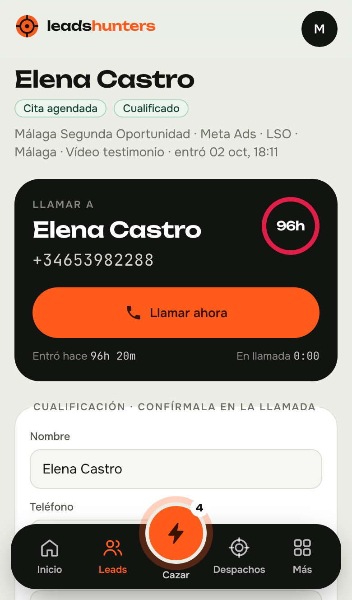

# Leads Hunters · App + flujos n8n



Herramienta para montar el servicio de captación para **despachos de abogados de Ley de Segunda Oportunidad**:

1. **Captar despachos (venta B2B).** Busca despachos en Google Maps, analiza su web, si anuncian en Meta y su Instagram, y los puntúa de 0 a 100 para saber a quién llamar primero. Pantalla de llamada con ganchos y guion.
2. **Dar el servicio a tus clientes.** Los leads de Meta y Google Ads entran solos, se cualifican (deuda, acreedores, ingresos…), aparecen en una **cola de llamadas** para contactarlos en menos de 5 minutos, se agenda la consulta con el despacho y se factura **500 € fijos + 30-50 € por consulta realizada**.

Todo en español, se instala en tu propio servidor con Docker.

---

## Qué hay dentro

| Parte | Qué hace |
|---|---|
| **App web** (Next.js + Postgres) | Panel, prospección, cola de llamadas, leads, consultas, clientes, facturación, usuarios |
| **API** `/api/v1/*` | La usan los flujos de n8n (clave `x-api-key`) |
| **8 flujos n8n** (`n8n/*.json`) | Prospección, entrada de leads de Meta y Google, avisos, recordatorios, informe mensual, respaldo |
| **Docker Compose** | App + Postgres + n8n (+ Caddy para HTTPS) |

### Pantallas de la app

- **Resumen**: leads de hoy, cualificados, consultas, velocidad de contacto (objetivo < 5 min), tasa de contacto, facturación del mes, embudo de venta de despachos.
- **Prospección**: listado de despachos con puntuación A/B/C, filtros, importación de archivos de Apify o CSV, exportación.
- **Ficha de despacho**: por qué tiene esa puntuación, ganchos para abrir la llamada, guion de venta, registro de llamadas, señales de marketing (web, WhatsApp, píxel, anuncios en Meta), botón **Convertir en cliente**.
- **Llamar despachos**: abre el siguiente despacho a llamar (acciones vencidas primero, luego los de mejor puntuación).
- **Cola de llamadas**: el telefonista pulsa «Coger el siguiente lead» y le sale la pantalla de llamada: teléfono grande, cronómetro desde que entró el lead, datos de cualificación editables, guion LSO y botones de resultado. Al guardar salta al siguiente. Dos telefonistas nunca cogen el mismo lead.
- **Leads**: todos los leads con filtros y exportación. Botón de **supresión RGPD**.
- **Consultas**: agenda; marcar asistió / no asistió / cancelar / mover.
- **Clientes**: condiciones económicas, criterios de cualificación (deuda mínima, acreedores, provincias), IDs de formularios de Meta/Google, clave y formulario web para pegar en la web del despacho.
- **Facturación**: por mes y cliente: cuota fija + consultas realizadas × precio, con tope opcional. Exporta CSV y justificante por cliente.
- **Ajustes**: estado de la configuración, endpoints de la API y gestión de usuarios (administrador / telefonista).
- **/confirmar/…** (pública): el despacho confirma con un clic si la consulta se realizó.

### Cómo puntúa a los despachos (0-100)

| Criterio | Máx. | Ejemplo |
|---|---|---|
| Encaje con el nicho | 30 | Su nombre o su web hablan de Segunda Oportunidad / cancelar deudas |
| Tamaño | 20 | 5-250 reseñas = pequeño/mediano (lo que buscamos); >600 = gran firma |
| Reputación | 10 | Valoración en Google |
| Ya invierte en captación | 20 | Anuncios activos en Meta (más si son de deudas), píxel en la web |
| Oportunidad | 10 | Sin web, sin formulario/WhatsApp, redes flojas, Instagram parado |
| Contacto | 10 | Teléfono y email |

A ≥ 70 · B 45-69 · C < 45. Sin teléfono, máximo 40.

### Cómo cualifica a los leads (Ley de Segunda Oportunidad)

- **Descarta**: menos acreedores que el mínimo del despacho (2 por defecto), deuda por debajo de su mínimo (8.000 € por defecto) o por encima de 5 M€, ya usó la LSO en 5 años, condenas por delitos económicos, sin teléfono.
- **Puntúa**: importe de la deuda, nº de acreedores, deuda frente a ingresos (insolvencia), situación laboral, vivienda en propiedad.
- Resultado: **cualificado** (≥ 55), **dudoso**, **no cualificado** o **pendiente** (faltan datos: se preguntan en la llamada).
- Las preguntas de los formularios no tienen que llamarse de ninguna forma concreta: la app reconoce «¿Cuánto debes?», «¿Con cuántos bancos?», «Entre 10.000 y 30.000 €», «3 o más», etc.

### Cola de llamadas

Orden: 1) leads nuevos sin llamar (el más reciente primero), 2) cualificados antes que pendientes, 3) rellamadas cuya hora ha llegado.
Si no contesta se reprograma sola: 10 min, 1 h, 3 h, día siguiente, +2 días, +3 días; después se descarta. Solo programa en horario de llamadas (L-V 9-21 h, S 10-14 h, hora de Madrid).

---

## Publicarla en 2 clics (Render)

[](https://render.com/deploy?repo=https://github.com/villaseca98/leadshunters)

1. Pulsa el botón, entra con tu cuenta de GitHub y elige el repo `leadshunters`.
2. Render te pide `ADMIN_EMAIL` y `ADMIN_PASSWORD` (mínimo 8 caracteres): será tu usuario para entrar.
3. Pulsa **Apply**. Render crea la base de datos, construye la app y te da una URL tipo `https://leadshunters-xxxx.onrender.com`.
4. En Render → servicio `leadshunters` → **Environment**, copia el valor de `N8N_API_KEY`. Pégalo, junto con la URL, en el nodo **Config** de cada flujo de n8n (`LH_API_KEY` y `LH_API_URL`/`APP_URL`).

El plan gratuito sirve para probar: la app se duerme si nadie la usa (tarda unos segundos en despertar) y la base de datos gratuita caduca a los 30 días. Para trabajar con clientes, sube a un plan de pago o usa la instalación con Docker de abajo.

## Instalación en un servidor (recomendado)

Necesitas un VPS con Docker (Hetzner, Contabo, DigitalOcean… 2 GB de RAM sobran) y dos subdominios apuntando a su IP, por ejemplo `app.tudominio.com` y `n8n.tudominio.com`.

```bash
# 1. Copia esta carpeta al servidor y entra en ella
cp .env.example .env
nano .env                       # rellena contraseñas, claves y dominios

# 2. Arranca todo (con HTTPS automático)
docker compose --profile https up -d --build

# 3. Crea tu usuario administrador (usa ADMIN_EMAIL y ADMIN_PASSWORD del .env)
docker compose exec app node scripts/seed.mjs

# 4. Importa los flujos en n8n
docker compose run --rm n8n import:workflow --separate --input=/flujos
```

- App: `https://app.tudominio.com` · n8n: `https://n8n.tudominio.com` (la primera vez te pide crear la cuenta de n8n).
- Las migraciones de la base de datos se aplican solas al arrancar la app.
- Sin dominio (solo para probar): `docker compose up -d --build` y entra en `http://IP:3000` y `http://IP:5678`. Pon `COOKIE_SECURE=false`.

### En tu ordenador, para desarrollar

```bash
npm install
# necesitas un Postgres local; crea .env.local con DATABASE_URL, SESSION_SECRET, N8N_API_KEY, APP_URL
npm run migrate
ADMIN_EMAIL=tu@email.com ADMIN_PASSWORD=unaclave123 npm run seed -- --demo
npm run dev        # http://localhost:3000
npm test           # pruebas de la lógica (puntuación, cualificación, rellamadas)
```

---

## Configurar n8n

### Nodo «Config» de cada flujo (funciona en n8n Cloud y en tu propio n8n)

Cada flujo empieza con un nodo **Config** justo después del disparador. Ábrelo y sustituye los valores `PEGA_AQUI_…` y `tudominio.com`. Solo aparecen las claves que usa ese flujo:

| Clave | Para qué |
|---|---|
| `LH_API_URL` | URL pública de la app, p. ej. `https://app.tudominio.com` |
| `LH_API_KEY` | La `N8N_API_KEY` del `.env` de la app |
| `APP_URL` | URL de la app para los enlaces de los avisos (normalmente igual que `LH_API_URL`) |
| `APIFY_TOKEN` | Google Maps Scraper e Instagram Profile Scraper de Apify |
| `META_ADS_LIBRARY_TOKEN` | API de la Biblioteca de anuncios de Meta |
| `TELEGRAM_CHAT_ID` | A dónde llegan los avisos |
| `GOOGLE_ADS_WEBHOOK_KEY` | Clave del webhook de formularios de Google Ads |
| `EMAIL_FROM`, `TWILIO_FROM` | Remitente de emails y (opcional) de SMS |
| `N8N_EVENTS_WEBHOOK_URL` | (flujo 07) URL de producción del webhook del flujo 04 |

> Los flujos ya no usan `$env`, así que funcionan en n8n Cloud. Las variables de n8n del `docker-compose.yml` son opcionales. En la app, pon en `N8N_EVENTS_WEBHOOK_URL` la URL de producción del webhook del flujo 04 (`https://TU-N8N/webhook/leads-hunters-eventos`).

### Credenciales que tienes que crear en n8n

- **Telegram**: crea un bot con @BotFather y pega el token. Para saber tu `TELEGRAM_CHAT_ID`, escribe al bot y abre `https://api.telegram.org/bot<TOKEN>/getUpdates`.
- **SMTP** (emails): el de tu proveedor de correo (Google Workspace, Brevo, etc.).
- **Facebook Lead Ads**: en el flujo 02.
- **Twilio** (opcional): los nodos de SMS vienen desactivados; actívalos si quieres SMS.

Abre cada flujo, asigna las credenciales en los nodos marcados en rojo y **actívalo**.

### Los flujos

| Flujo | Disparador | Qué hace |
|---|---|---|
| **01 · Prospección** | A mano o cada lunes 7:00 | Apify Google Maps (búsquedas × ciudades de «Configuración») → app (limpia, deduplica, puntúa) → analiza la web, los anuncios en Meta y el Instagram de cada despacho → Telegram con el resumen |
| **02 · Leads de Meta** | Nuevo lead en un formulario | Lo manda a la app; el ID del formulario decide el despacho |
| **03 · Leads de Google Ads** | Webhook `/webhook/google-ads-leads` | Comprueba la `google_key`, lo manda a la app |
| **04 · Eventos de la app** | Webhook `/webhook/leads-hunters-eventos` | Lead nuevo → Telegram al equipo · Cita agendada → email al despacho (con enlace de confirmación) y al lead · Asistió / no asistió / nuevo cliente → aviso |
| **05 · Recordatorios** | Cada 30 min | Recordatorio al lead de las consultas de las próximas 24 h |
| **05b · Confirmar asistencia** | Cada día 20:00 | Pide a cada despacho confirmar las consultas pasadas (solo se facturan las realizadas) |
| **06 · Informe mensual** | Día 1, 9:00 | Email a cada despacho con sus resultados e importe · Total a facturar por Telegram |
| **07 · Respaldo** | Cada 10 min | Reenvía eventos que no llegaron (si n8n estuvo caído) |

Para cambiar ciudades o búsquedas, edita el nodo **Configuración** del flujo 01. Si cambias el código de los flujos, puedes regenerarlos con `node scripts/generar-flujos-n8n.mjs`.

### Dar de alta un cliente nuevo (checklist)

1. En su ficha de Prospección pulsa **Convertir en cliente** (o Clientes → Nuevo).
2. Revisa cuota, precio por consulta, deuda mínima y provincias.
3. Crea su campaña y formulario en Meta/Google y pega los **IDs de formulario** en la ficha.
4. En Google Ads, webhook a `https://n8n.tudominio.com/webhook/google-ads-leads` con tu `GOOGLE_ADS_WEBHOOK_KEY`.
5. Pon el **email para avisos** del despacho: ahí le llegan las consultas.
6. Opcional: pega el **formulario web** de su ficha en la web del despacho.

---

## Probar sin anuncios

Con la app arrancada (cambia la clave y el `client_id` por los tuyos; el ID está en la ficha del cliente):

```bash
# Un despacho como los que devuelve Apify
curl -X POST http://localhost:3000/api/v1/prospects -H "x-api-key: $N8N_API_KEY" -H "content-type: application/json" \
  -d '[{"title":"Abogados Segunda Oportunidad Valencia","categoryName":"Abogado","city":"Valencia","postalCode":"46004","phone":"961234567","totalScore":4.7,"reviewsCount":85}]'

# Un lead como los de Meta
curl -X POST http://localhost:3000/api/v1/leads -H "x-api-key: $N8N_API_KEY" -H "content-type: application/json" \
  -d '{"client_id":"ID-DEL-CLIENTE","source":"meta","answers":{"full_name":"María Pérez","phone_number":"612345678","¿cuánto debes en total?":"Entre 20.000 y 40.000 €","¿con cuántos bancos?":"4"}}'
```

Aparecerá en la cola de llamadas al momento.

---

## RGPD y deontología

- **Prospección solo de empresas** (despachos): datos públicos de su ficha de Google y su web. No se recogen datos de particulares.
- **Leads de particulares solo con consentimiento**: llegan de formularios de anuncios o de la web del despacho; se guarda cuándo y con qué texto consintieron. El formulario web incluido trae casilla de consentimiento obligatoria: enlaza tu política de privacidad.
- **Derecho de supresión**: botón en la ficha del lead (administradores). Anonimiza nombre, teléfono, email y notas, y deja registro sin datos personales.
- **Encargo de tratamiento**: firma un contrato de encargado del tratamiento con cada despacho (tú tratas datos de sus potenciales clientes).
- **Facturación**: cuota fija de marketing + importe por consulta realizada, **nunca un porcentaje de los honorarios** del despacho.

---

## Estructura

```
src/app/(app)/        pantallas del panel (requieren login)
src/app/api/v1/       API para n8n
src/app/confirmar/    página pública de confirmación para despachos
src/lib/scoring.ts    puntuación de despachos
src/lib/qualify.ts    cualificación LSO de leads
src/lib/normalize.ts  limpieza de teléfonos, importes, provincias y respuestas de formularios
src/lib/schedule.ts   horario y cadencia de rellamadas
src/lib/services/     lógica de prospectos, leads, eventos y facturación
db/migrations/        esquema de la base de datos
n8n/                  flujos importables
scripts/              migraciones, alta de admin, generador de flujos
tests/                pruebas
```
